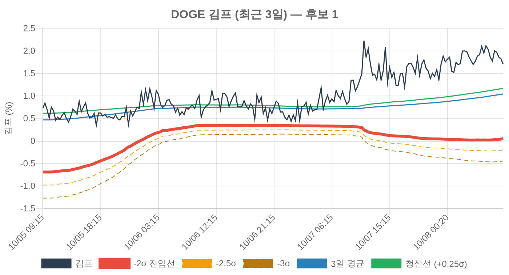
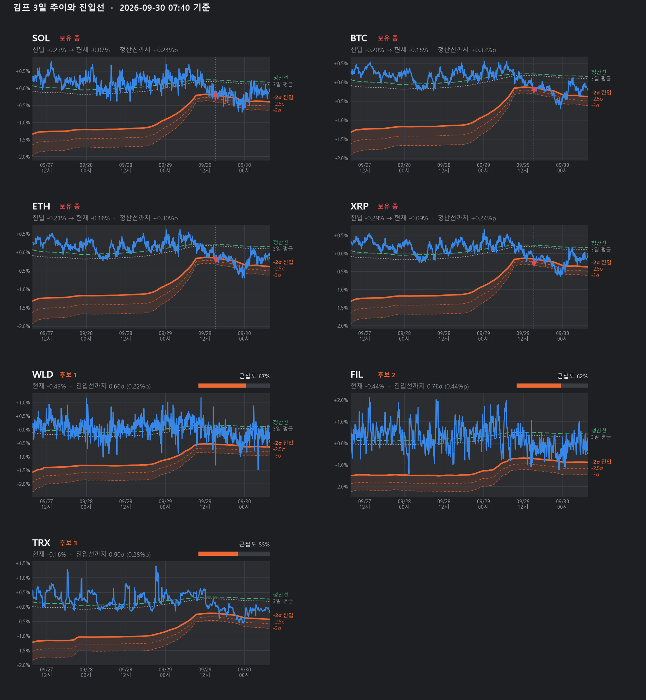

# 아침 상태 보고 차트

매일 07:42 KST, 07:40 상태 보고 바로 뒤에 Discord 상태 채널로 차트가 갑니다 (2026-10-08 가동).
보유 중인 종목 전부와 진입선에 가장 가까운 후보 3종목의 최근 72시간입니다.



## 서버에서 도는 것 — `server/`

| 파일 | 서버 위치 |
|---|---|
| `chart-report.js` | `/opt/kimchi-bot/scripts/chart-report.js` |
| `kimchi-chart.service` · `.timer` | `/etc/systemd/system/` (사본 `/opt/kimchi-bot/deploy/`) |
| `backup-history.js` | `/opt/kimchi-bot/scripts/backup-history.js` |
| `kimchi-backup.service` · `.timer` | 위와 같음 |

- **봇 프로세스와 따로 돕니다.** 봇 코드는 고치지 않았고 재시작도 하지 않았습니다. DB 는 읽기 전용으로 엽니다.
- 그림은 한스법칙 알림과 같은 QuickChart 로 그립니다. 서버에 새로 설치한 것이 없습니다.
- 선은 봇이 회차마다 `signal_log` 에 적어 둔 평균·σ 를 그대로 씁니다 (다시 계산하지 않음).
- ⚠️ QuickChart 무료 한도가 차트당 점 개수를 막습니다. 864점(5분)·288점(15분)은 오류 이미지가 나오고
  216점(20분)은 통과했습니다 (2026-10-08 실측). 그래서 **20분 간격**으로 그립니다.
  한도에 걸려도 주소는 정상으로 돌아오므로, 스크립트가 그림 크기를 보고 오류 이미지를 걸러냅니다.
- 시험: `sudo -u kimchi node scripts/chart-report.js --dry-run` (보내지 않고 주소만 찍음)
- 끄기: `systemctl disable --now kimchi-chart.timer`

## 후보 3종목을 고르는 기준

거래 대상(`universe.tradable`)이고 보유 중이 아닌 종목 중에서, 봇이 실제로 들어갈 수 있는 상태인 것을
먼저 놓고 진입선까지 남은 거리(σ)가 짧은 순으로 고릅니다. «들어갈 수 있는 상태»는 셋입니다.

1. σ 가 한도(`MAX_SIGMA_PERCENT` 2.5) 안
2. 72시간 이력이 80% 이상 채워짐
3. 진입선에 닿았을 때의 기대이익(2σ)이 본전 문턱(수수료 + 평소 스프레드)의 3배(`EDGE_MULTIPLE`) 이상

3번이 없으면 5분마다 크게 튀기만 하는 종목이 늘 상위에 올라옵니다. 세 종목을 못 채우면 조건 미달 종목으로
채우고 «⚠️ 순이익 조건 미달» 이라고 적습니다.

## 왜 사지 않았나 — 후보마다 같이 적는다 (2026-10-08 사용자 요청)

차트로는 진입선 아래로 내려갔는데 봇이 사지 않은 종목이 있습니다 (FIL 이 그랬다 — 3일간 신호 35회, 전부 보류).
봇은 신호가 뜨면 실제 호가를 확인하고, 스프레드가 1% 를 넘거나 기대수익이 «스프레드+수수료» 의 3배에
못 미치면 보류합니다. 그 사유가 `runs.note` 에 남으므로, 후보마다 최근 3일의 신호 횟수 · 보류 횟수 ·
사유별 횟수 · 마지막 보류 문구를 차트 아래에 적습니다. 신호가 없었으면 «아직 진입선에 닿은 적이 없습니다».

## 선

| 선 | 뜻 |
|---|---|
| 남색 선 | 김치 프리미엄 (5분 간격) |
| 굵은 빨간 선 | 진입선 — 3일 평균 − 2σ. 봇이 실제로 쓰는 선 |
| 가는 주황 점선 | −2.5σ, −3σ. 얼마나 깊이 들어왔는지 보는 눈금이며 봇 동작과는 무관 |
| 파란 선 | 3일 평균 |
| 초록 선 | 청산선 — 3일 평균 + 0.25σ |
| 빨간 ▼ | 진입 시점과 진입 김프 (보유 종목만) |

## 견본 (n8n 시절 이력으로 그린 것) — `kimp_chart.py`

모양을 정할 때 쓴 matplotlib 견본입니다. 서버에서는 쓰지 않습니다.



```
pip install matplotlib pandas
python report/kimp_chart.py "2026-09-29T22:40:00Z" report/sample.png
```

## 이력 보관과 백업 (2026-10-08)

카페24 봇은 5분 김프를 **지우지 않고 계속 쌓습니다.** `/opt/kimchi-bot/data/kimchi.db` 의 `premium_history`.

- 봇이 직접 잰 값: 2026-10-02 16:00 UTC ~ 현재, 하루 약 3.4만 행 (117~119종목)
- n8n 에서 옮겨 온 값: 2026-09-28 20:15 ~ 10-02 15:55 UTC
- 삭제·정리 코드는 봇 어디에도 없습니다. DB 는 9일치에 65MB, 디스크 여유 31GB.
- 그보다 앞선 기록(2026-09-05 ~)은 이 저장소 `backup/data/premium-history` 의 CSV 에만 있습니다.

백업은 두 겹입니다.

| | 무엇을 | 어디에 | 언제 | 막는 것 |
|---|---|---|---|---|
| 서버 안 | DB 전체 스냅샷 | `/var/backups/kimchi-bot/kimchi-<날짜>.db.gz` (14일 보관) | 매일 03:30 KST (`/etc/cron.d/kimchi-bot-backup`, 봇 설치 때부터 있던 것) | 실수로 지움 · DB 손상 |
| 서버 밖 | 김프 이력(하루 한 파일) + 거래·거래 대상 | 이 저장소 **`backup-kimchi-<연-월>` 브랜치** (달마다 하나) | 매일 09:20 KST (`kimchi-backup.timer` → `server/backup-history.js`) | 서버 디스크 고장 · 서버 해지 |

- 이번 달·지난달 브랜치는 매번 빠진 날을 채웁니다. 며칠 빠져도 다음 실행이 따라잡습니다.
- 하루치가 gzip 으로 약 0.5MB — 한 달 브랜치가 약 15MB 입니다.
- 실패하면 Discord 상태 채널로 «⚠️ 김프 봇 DB 백업 실패» 가 갑니다.

### 오래된 백업은 자동으로 지운다 — 3년 (2026-10-08 사용자 요청)

**36개월이 지난 달의 브랜치를 매일 실행 때 지웁니다.** 저장소는 약 600MB 에서 더 커지지 않습니다
(GitHub 권장 1GB 아래). 기간을 바꾸려면 `kimchi-backup.service` 에
`Environment=BACKUP_RETAIN_MONTHS=12` 한 줄을 넣습니다.

달마다 브랜치를 나눈 이유가 이것입니다. git 은 파일을 지워도 이력에 남아 저장소가 줄지 않습니다.
브랜치를 통째로 지워야 실제로 비워집니다. 지우기는 시험용 `backup-kimchi-2020-01` 브랜치를 만들어
실제로 지워지는 것을 확인했습니다. 이름이 정확히 `backup-kimchi-YYYY-MM` 인 브랜치만 건드립니다.

- 지워지는 것은 GitHub 쪽 사본뿐입니다. **서버의 `kimchi.db` 는 줄이지 않습니다** — 봇 DB 는 그대로 쌓입니다
  (하루 약 7MB, 디스크 여유 31GB 로 10년쯤).
- GitHub 가 지워진 브랜치의 용량을 실제로 회수하는 시점은 GitHub 내부 정리에 달려 있어 확인하지 못했습니다.
- 되살리기: 통째로는 `gunzip kimchi-<날짜>.db.gz` 후 `data/kimchi.db` 자리에 놓고 봇 재시작.
  서버가 없어졌다면 `git fetch origin 'refs/heads/backup-kimchi-*:refs/remotes/origin/backup-kimchi-*'` 로 달별 CSV 를 받아 `premium_history` 에 다시 넣습니다
  (넣는 스크립트는 아직 없습니다 — 열 이름이 테이블과 같아 `sqlite3 .import` 로 됩니다).

## 확인 안 된 것

- 진입선은 스프레드 보정 없이 그렸습니다. 봇은 실매수호가 기준 김프가 선 아래여야 진입하므로
  실제 진입은 선보다 조금 아래에서 일어납니다.
- 20분 간격이라 그 사이의 짧은 급락은 차트에 안 보일 수 있습니다. 봇의 판정은 5분 값으로 합니다.
- QuickChart 무료 한도의 정확한 숫자와 하루 호출 한도는 확인하지 않았습니다. 하루 최대 7장을 씁니다.
- 서버 밖 사본에는 `signal_log`·`runs` 가 없습니다. 이력에서 다시 계산할 수 있는 값이라 뺐습니다.
- 서버 밖 사본에서 되살리는 연습은 해 보지 않았습니다.
